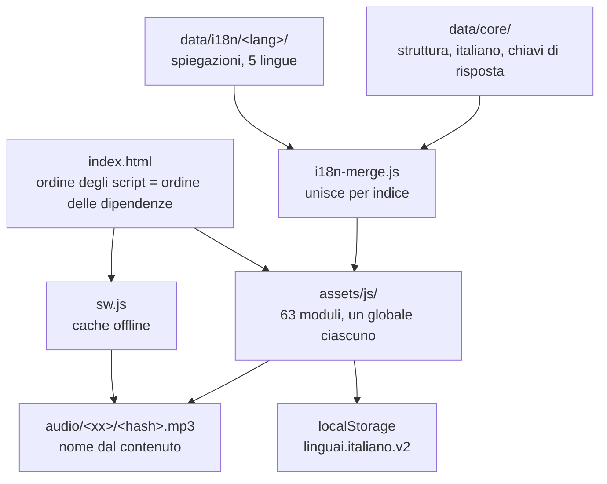

[English](./README.md) | **Italiano** | [Polski](./README.pl.md)

# Impara l'Italiano

Un corso di italiano statico, dall'A1 al C2, che gira tutto nel browser: niente account, niente server, niente build, niente da installare.


150 lezioni, 1514 esercizi e 3494 frasi italiane registrate, spiegate nella lingua di chi studia. Si apre `index.html` e il corso parte.

Il programma di grammatica sale livello per livello dall'A1 al C2. Le spiegazioni esistono in cinque lingue (polacco, inglese, spagnolo, francese, tedesco) e si cambiano quando si vuole, senza perdere i progressi. Tutto quello che lo studente fa resta nel suo browser. Una cosa sola esce dal dispositivo: la registrazione della voce mandata al riconoscimento vocale, e solo dopo che lui ha acconsentito.

**Online:** [andreabonn.github.io/impara-italiano](https://andreabonn.github.io/impara-italiano/)

## Indice

- [Cosa c'è nel repository](#cosa-cè-nel-repository)
- [Stack tecnologico](#stack-tecnologico)
- [Architettura](#architettura)
- [Struttura del repository](#struttura-del-repository)
- [Prerequisiti](#prerequisiti)
- [Installazione](#installazione)
- [Esecuzione locale](#esecuzione-locale)
- [I controlli di qualità](#i-controlli-di-qualità)
- [Aggiungere contenuto al corso](#aggiungere-contenuto-al-corso)
- [La pipeline audio](#la-pipeline-audio)
- [Deploy e CI](#deploy-e-ci)
- [Manuale utente](#manuale-utente)
- [Sicurezza](#sicurezza)
- [Licenza](#licenza)
- [Supporta il progetto](#supporta-il-progetto)

## Cosa c'è nel repository

| Voce | Quantità |
|---|---|
| Unità / lezioni / esercizi | 32 / 150 / 1514 |
| Voci di vocabolario | 1412 |
| Tipi di esercizio | 14 |
| Conversazioni parlate | 14 |
| Voci della grammatica di riferimento | 42 |
| Letture / prove di scrittura / serie di coppie minime | 12 / 6 / 5 |
| Frasi registrate | 3494 mp3, 45 MB |
| Lingue di spiegazione | 5, con 740 stringhe di interfaccia ciascuna |
| File del motore | 63 file, 11 881 righe |

Questi numeri si rigenerano con `node scripts/validate.mjs`.

Oltre alle lezioni il corso porta un mazzo di ripetizione dilazionata (FSRS per il vocabolario, SM-2 per il quaderno degli errori), esercizi generati da regole che non finiscono mai, un coniugatore che copre quattordici tempi, una simulazione dell'esame CILS B1 con il cronometro per sezione e una schermata di copertura che misura lo studente sulle forme più frequenti dell'italiano reale.

## Stack tecnologico

**Applicazione (quello che arriva al browser)**

- JavaScript ES5+, script classici, un globale per file. Nessun framework, nessun bundler, nessun polyfill.
- CSS in un foglio unico, colori in OKLCH.
- Fraunces e Inter, ospitati nel repository come woff2 (280 KB, licenza SIL Open Font). La pagina non contatta nessun dominio esterno.
- Service worker per il funzionamento offline e web app manifest per l'installazione.

**Toolchain (solo per lo sviluppo)**

- Node.js 24 per gli script e i test unitari (`node:test`, `node:vm`).
- Playwright 1.63 per i test nel browser, ESLint 10 per la correttezza, axe-core 4.13 dentro i test di accessibilità.
- Python via `uv` per la generazione delle registrazioni, che richiede `ffmpeg` e l'accesso a Edge TTS.

`package.json` esiste per la toolchain di test. `index.html` non ne carica niente e il corso funziona anche senza `npm install`.

## Architettura

Due regole spiegano quasi tutto l'impianto. I dati del corso stanno separati dal motore e, dentro i dati, quello che è italiano sta separato da quello che lo studente legge nella sua lingua.



Una frase italiana esiste in un posto solo, in `data/core/`. Il nome del file di una registrazione è l'hash di quella frase, quindi non può divergere fra una lingua e l'altra, e aggiungere una sesta lingua di spiegazione non genera nemmeno un mp3 nuovo.

Il motore tiene le funzioni pure distinte da tutto ciò che tocca il browser. La metà pura si verifica con `node:test` per pochissimo; l'altra metà richiede Playwright. È questo confine a decidere se un modulo va spezzato. La lunghezza no: `store.js` e `verbs-data.js` restano interi perché dividerli separerebbe cose che devono restare d'accordo fra loro.

## Struttura del repository

```text
index.html              guscio dell'applicazione; l'ordine degli script è il grafo delle dipendenze
sw.js                   strategia offline, versione con impronta calcolata da PRECACHE
manifest.webmanifest    metadati per l'installazione come app
assets/
  css/app.css           tutto il sistema visivo
  fonts/                Fraunces e Inter, con i rispettivi testi OFL
  icons/                icone dell'app, compresa quella maskable
  js/                   63 moduli del motore, un oggetto globale per file
data/
  core/                 strato neutro: struttura, italiano, chiavi di risposta
  i18n/<lang>/          spiegazioni nella lingua dello studente (pl, en, es, fr, de)
  audio-index.js        hash ordinati di tutte le frasi che hanno una registrazione
audio/<xx>/<hash>.mp3   registrazioni, generate
scripts/                validazione, parità, copertura, mutazioni e strumenti di build
tests/
  unit/                 826 asserzioni in node:vm, senza browser
  dom/                  232 asserzioni Playwright in Chromium
docs/                   manuale utente, inglese e italiano
```

## Prerequisiti

Per usare il corso non serve niente. Basta un browser che apra `index.html`.

Per gli strumenti di sviluppo:

| Requisito | Versione | Serve per |
|---|---|---|
| Node.js | 24 o superiore | script, test unitari, Playwright |
| Python via `uv` | 3.10 o superiore | generare le registrazioni |
| ffmpeg | recente | generare le registrazioni |

Node 24 e non 20: `npm test` passa il glob `tests/unit/**/*.test.mjs` direttamente a `node --test`, che lo accetta solo dalla 21 in poi.

## Installazione

1. Clona il repository.

   ```bash
   git clone git@github.com:AndreaBonn/impara-italiano.git
   cd impara-italiano
   ```

2. Installa le dipendenze di sviluppo. Se ti interessa solo usare il corso, salta questo passo.

   ```bash
   npm install
   ```

3. Installa il browser che Playwright pilota.

   ```bash
   npx playwright install --with-deps chromium
   ```

## Esecuzione locale

Aprendo `index.html` dal disco il corso funziona, con due limiti imposti dal browser: il riconoscimento vocale richiede un contesto sicuro e il service worker non si registra su `file://`.

Perché funzioni tutto, serve un server:

```bash
npm run serve          # http://localhost:8080
npm run serve -- 3000  # su un'altra porta
```

Usa questo e non `python3 -m http.server`. Il secondo continua a servire gli script vecchi dopo una modifica, quindi la pagina mostra qualcosa che nel repository non c'è più e il bug si cerca in un codice già corretto. `scripts/serve.mjs` risponde sempre `Cache-Control: no-store` e si rifiuta di servire file fuori dalla cartella del progetto.

## I controlli di qualità

Tutti i controlli qui sotto girano a ogni `push` e a ogni `pull_request`, dal più economico al più costoso, così un errore nei dati si segnala in pochi secondi invece che dopo un minuto di test nel browser.

| Comando | Cosa verifica |
|---|---|
| `npm run lint` | correttezza, non stile. ESLint flat config, quattro blocchi per quattro nature di file |
| `node scripts/validate.mjs [lingua]` | id duplicati, completezza degli esercizi, lacune contro le risposte, parole della lingua dello studente finite nello strato neutro |
| `node scripts/parity.mjs` | che ogni strato di lingua abbia la stessa forma di quello polacco |
| `node scripts/check_precache.mjs` | che il service worker metta in cache tutto ciò che `index.html` carica |
| `node scripts/check_swversion.mjs [--napraw]` | che una versione nuova abbia un'impronta con cui annunciarsi |
| `npm test` | 826 asserzioni in 34 file, logica del motore dentro `node:vm` |
| `npm run test:mutations` | 34 mutazioni deliberate; ciascuna deve far diventare rosso un file di test dichiarato |
| `node scripts/coverage.mjs --min 99` | copertura del motore, oggi al 99,8% |
| `npm run test:dom` | 232 asserzioni in Chromium, compreso il contrasto misurato dal browser |
| `npm run test:all` | unitari, mutazioni e DOM in un colpo solo |

Il test di mutazione risponde alla domanda a cui la copertura non risponde. La copertura dice che una riga è stata eseguita, ed eseguire non è verificare. Un'asserzione come `assert.ok(!out.includes("js-play"))` passa anche su un risultato vuoto, con copertura piena e contenuto zero, e tre asserzioni scritte il giorno in cui quel controllo è nato erano esattamente così.

Il test sul contrasto misura il colore attraverso il browser e non attraverso un parser. La palette è in OKLCH, e gli strumenti di accessibilità esterni leggono `oklch(0.31 0.035 350)` come una terna RGB e riportano un canale a 350: il loro numero è un artefatto, non una misura. Qui il colore passa per un canvas 1×1 e torna in sRGB, così la conversione la fa il motore e la soglia è vera.

Se `npm run lint` riporta ESLint 6.4.0, ha risposto l'eslint di sistema al posto di quello del progetto. Lancia `./node_modules/.bin/eslint .`.

## Aggiungere contenuto al corso

Un'unità vive in due file con lo stesso nome, uno per strato.

In `data/core/` va tutto ciò che è italiano, tutto ciò che verifica una risposta e la struttura:

```js
LINGUAI.addUnits("A1", [{
  id: "a1-u11", icon: "🚲", titleIt: "In bicicletta",
  tags: ["g-preposizioni"],
  lessons: [ /* … */ ],
  test: { /* … */ }
}]);
```

In `data/i18n/<lang>/` va solo ciò che lo studente legge nella sua lingua, nello stesso ordine:

```js
LINGUAI.addStrings("pl", {
  "unit:a1-u11": { title: "Rowerem po mieście", grammarNote: "przyimki ruchu" },
  "lesson:a1-u11-l1": { title: "…", theme: "…", objectives: [ /* … */ ] }
});
```

Gli array si uniscono **per indice**, quindi devono avere lo stesso numero di elementi da entrambe le parti. Una nota contrastiva («nella tua lingua funziona diversamente») si scrive da capo per ogni lingua invece di tradurla: quello che è una trappola per un polacco spesso a un americano non dice niente.

Poi si lanciano i controlli:

```bash
node scripts/validate.mjs
node scripts/parity.mjs
```

Due regole del validatore su cui è facile inciampare. Nello strato neutro non deve comparire nessuna parola nella lingua dello studente, quindi l'etichetta di una costruzione si scrive in italiano (`dopo aver + participio`) e così il prompt di un esercizio (`Colloquiale:`). E ogni lezione vuole almeno un `tags` che nomini un id vero di `GRAMMAR_REF`, perché è così che il quaderno degli errori dà un nome a quello che è andato storto.

Dopo aver aggiunto un file in `assets/js/` o in `data/core/`, aggiungilo a `PRECACHE` in `sw.js`. Se te ne dimentichi `check_precache.mjs` fa fallire la build, e `check_swversion.mjs --napraw` rinfresca l'impronta.

## La pipeline audio

Le frasi del corso sono registrate, non sintetizzate dal browser. Su Linux la Web Speech API di solito ricade su espeak-ng, che suona meccanico, e sugli altri sistemi la qualità è imprevedibile. Un backend avrebbe risolto, al prezzo di un corso che non sarebbe più statico.

```bash
node scripts/extract_strings.mjs                    # raccoglie le frasi da data/core/
uv run --script scripts/build_audio.py --dry-run    # quanti file mancano
uv run --script scripts/build_audio.py              # genera solo quelli mancanti
```

Il nome del file è l'hash FNV-1a a 64 bit del testo della frase, calcolato da `audio_hash()` in Python e da `Recordings.hash()` in `assets/js/recordings.js`. Cambiare una delle due impone di cambiare l'altra, altrimenti tutte le registrazioni diventano irraggiungibili. Siccome il nome viene dal contenuto, una frase invariata tiene il suo file e le esecuzioni successive non muovono niente in git.

Due voci: `it-IT-IsabellaNeural` legge, `it-IT-GiuseppeMultilingualNeural` fa il secondo parlante nei dialoghi.

Quando aggiungi una coppia minima, lancia `uv run --script scripts/check_minpairs.py`. La voce onora gli accenti in modo diseguale: `pèsca` e `pésca` ricevono due file diversi, ma `vènti` e `vénti` tornano identici byte per byte, e una coppia che nessuno distingue insegna solo a tirare a indovinare. Non lo mostrerebbe niente: né lo schermo, né il codice, né i test.

## Deploy e CI

`.github/workflows/ci.yml` esegue gli undici controlli elencati sopra, su Node 24 e con Chromium installato.

Il sito è pubblicato su GitHub Pages dalla radice di `main`, quindi ogni push ridispiega. Non c'è nessun passo di build: quello che sta nel repository è quello che riceve il browser.

Le nuove versioni si annunciano invece di prendere il posto della precedente. Un service worker nuovo aspetta in `waiting` finché la pagina non lo chiede allo studente, perché senza build i nomi dei file non portano un hash e un subentro silenzioso lascerebbe una scheda aperta con codice vecchio sopra file nuovi. La versione è `v35.<12 esadecimali>`, dove l'impronta è un hash del contenuto di `PRECACHE` scritta da `check_swversion.mjs --napraw` e sorvegliata in CI, così una correzione in `core.js` non può uscire come una versione che nessuno vedrà.

## Manuale utente

Il manuale per chi studia sta in `docs/`, nelle due lingue:

- [Manuale utente (italiano)](./docs/MANUALE-UTENTE.md)
- [User manual (English)](./docs/USER-MANUAL.md)

Il corso porta anche una guida più breve dentro di sé, nella scheda «Come si usa».

## Sicurezza

Il corso non ha server, non ha account e non fa nessuna richiesta a domini di terzi. Cosa questo esclude e cosa invece no sta scritto in [SECURITY.it.md](./SECURITY.it.md), insieme a come segnalare una vulnerabilità.

Una cosa va detta anche qui: il riconoscimento vocale manda una registrazione della voce dello studente al server del suo browser. È l'unico traffico in uscita di tutto il corso, è protetto da un consenso esplicito, e rifiutarlo trasforma gli esercizi interessati in esercizi scritti.

## Licenza

Il codice è rilasciato con licenza MIT. Il contenuto del corso, registrazioni comprese, è rilasciato con licenza CC BY-SA 4.0. Vedi [LICENSE](./LICENSE) e [LICENSE-CONTENT](./LICENSE-CONTENT).

I font sono lavoro di terzi sotto SIL Open Font License, e i loro testi viaggiano con loro in `assets/fonts/`. La lista di frequenza deriva dal [progetto Tatoeba](https://tatoeba.org) sotto CC BY 2.0 FR, e quell'attribuzione è dovuta.

## Supporta il progetto

Se il corso ti è stato utile, una stella su [GitHub](https://github.com/AndreaBonn/impara-italiano) aiuta altri studenti a trovarlo.
